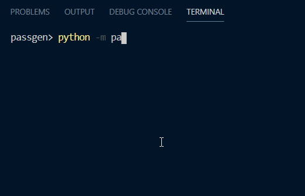

# passgen
A simple-as-hell password generator CLI.

# How to use?
It's very simple.
- Run the package by doing `python -m passgen`.
- To be familiar with flags add `-h (--help)` at the end, this displays you some useful information.
- As example, let's do `python -m passgen -n -uc -sc`. This includes all features the project provides: numbers, upper-case letters and special characters.

